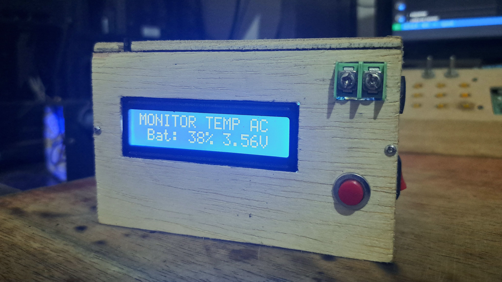
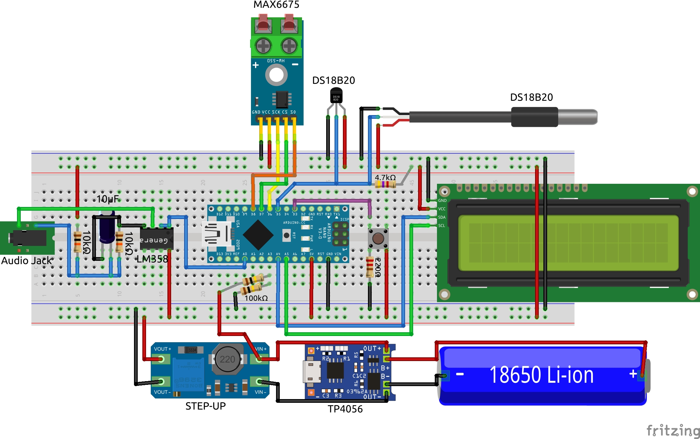
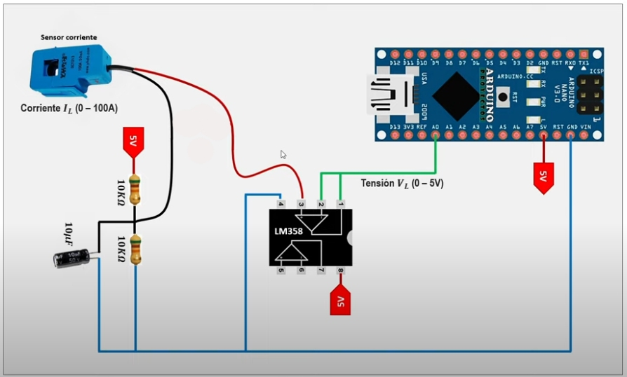

# Monitor de Temperatura y Corriente AC - ARDUINO

Este proyecto es un sistema portátil que permite monitorear la temperatura ambiente **DS18B20**, la temperatura mediante una termocupla **MAX6675**, y la corriente eléctrica AC **SCT-50A** utilizando sensores, mostrando toda la información en una pantalla LCD de 16x2 a través de I2C. También incluye una función para verificar el nivel de batería restante.

  

## 🗺️ Diagrama

  

## ⚙️ Funciones

- **Temperatura ambiente:** Medida mediante un sensor DS18B20.
- **Temperatura con termocupla:** Utilizando un módulo MAX6675.
- **Corriente eléctrica:** Cálculo del RMS con un sensor SCT-50A.
- **Nivel de batería:** Indicador del porcentaje y el voltaje restante.
- **Interfaz:** Alternar entre cada funcion presionando un botón.
  - **Modo 0:** Nivel de batería restante (porcentaje y voltaje).
  - **Modo 1:** Temperatura ambiente con 2 sensores DS18B20 con modelos Encapsulado TO-92
    y Sonda impermeable.
  - **Modo 2:** Temperatura con termocupla (MAX6675).
  - **Modo 3:** Corriente eléctrica (SCT-50A).

> ❗El sensor SCT-50A debe ser calibrado utilizando un dispositivo de consumo de corriente alterna (AC) con un consumo conocido o medido previamente, lo que permitirá ajustar el valor de calibración para obtener lecturas precisas.

> ⚠️ Los módulos de carga, como el TP4056 o la mayoría, no deben ser utilizados para cargar la batería y alimentar el dispositivo simultáneamente. Realizar ambas funciones al mismo tiempo puede resultar en problemas con la batería, poniendo en riesgo el circuito como la seguridad de la batería.

## 🧰 Componentes

- 1x **Board:** Arduino Nano o UNO R3.
- 1x **Display LCD I2C:** LCD 16x2.
- 1x **Sensor DS18B20 Emcapsulado:** Para medir temperatura ambiente.
- 1x **Sensor DS18B20 Sonda:** Para medir temperatura de liquidos.
- 1x **Resistencia:** 4.7Kohm.
- 1x **Módulo MAX6675 y Termocupla:** Para termocupla, medir altas temperaturas.
- 1x **Pulsador momentaneo:** Para cambiar entre las distintas métricas.
- 1x **Resistencia:** 220ohm para el pulsador.
- **Sensor de corriente** Medir AC hasta 50A.
  - 1x **Sensor SCT-50A:** Para medir corriente eléctrica.
  - 2x **Resistencias:** 10kohm.
  - 1x **Capacitor:** 10uF.
  - 1x Circuito integrado LM358.
  - 1x Conector jack hembra 3.5mm. compatible para el SCT.
- **Niver de batería:**
  - 1x Bateria 18650
  - 2x **Resistencias:** 100kohm para el divisor de voltaje.
- 1x Conecto hembra para alimentacion.

## ⚡ Sensor de Corriente SCT-50A

  

## 📚 Librerías:

- LiquidCrystal_I2C `v1.1.2`
- MAX6675 `v0.3.2`
- DallasTemperature `v3.9.0`

> Descargar las librerias desde el gestor de librerias del IDE de arduino.

## 📝 Notas

- El monitoreo de batería es solo una función para verificar la carga restante del dispositivo.
- Calibra los valores de los sensores según tus necesidades:
  - `calibAmp` para la corriente.
  - `calibBat` para el voltaje de batería.
- Asegúrate de que el módulo MAX6675 y el sensor DS18B20 estén conectados correctamente para evitar errores de lectura.
